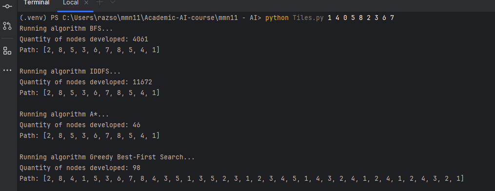

# 8-Puzzle Solver
## Program Description

The 8-puzzle is a classic artificial intelligence problem. It consists of a 3x3 grid with eight numbered tiles and one empty space. The goal is to slide the tiles, one at a time, into the empty space until the tiles are arranged in a specific goal configuration.

## Implemented Algorithms

### Uninformed Search:
#### Breadth-First Search (BFS):
search algorithm used to explore all vertices of a graph in a breadthward motion. It starts at a source node and explores all its neighbors before moving on to their neighbors, and so on.
#### Iterative Deepening Search (IDDFS):
A hybrid search algorithm that iteratively increases the depth limit of Depth-Limited Search
### Informed Search:
#### A* Search:
A heuristic search algorithm that efficiently explores the search space by combining the cost of the path so far (g(n)) with an estimated cost to reach the goal (h(n)).
#### Greedy Best-First Search (GBFS):
A heuristic search algorithm that prioritizes nodes based solely on their estimated cost to the goal

## Main Data Structures:
#### Priority Queue (Heapq):
Used in A* and Greedy Best-First Search to efficiently prioritize nodes based on their estimated cost (f(n) for A* and heuristic value for Greedy Best-First Search).
#### Set:
Used to keep track of visited nodes to prevent cycles and redundant exploration.
#### Dictionary:
Used to store the parent-child relationships between nodes in the search tree, allowing for path reconstruction.
#### Deque:
Used in Breadth-First Search to explore nodes in a first-in-first-out manner.

## Files And Functions:
* ### bfs.py:
    * bfs: takes two parameters: the start state and the goal state. The start state is provided as input from the terminal, while the goal state is predefined. Explores the state space starting from the initial state, expanding all possible moves level by level until the goal state is found
* ### iddfs.py:
    * iddfs: Takes two parameters the same as bfs. Performs dls for increasing depth limits until the goal is found.
    * dls: Takes five parameter, the start state, the goal, the depth of each it will search, the visited nodes and varaible that will return the amount of nodes been developed during the running of the algorithm. Performs a depth-first search within a specified depth limit to explore the state space. It recursively expands neighbors and backtracks if no solution is found at the current depth, returning the path and developed node count if the goal is reached.
* ### Astar.py:
    * astar: Takes two parameters the same as bfs. Uses the A* algorithm to find the shortest path by combining the actual cost (g(n)) with a heuristic (h(n)) based on the permutation transpositions count, which measures how many tile swaps are needed to reach the goal.
* ### gbfs.py:
    * gbfs: Takes two parameters the same as bfs. Uses the Greedy Best-First Search (GBFS) algorithm to find the path from the start state to the goal state by prioritizing nodes based on their heuristic value. It uses the permutation transpositions count as the heuristic.
* ### heuristic_function:
    * permutation_transpositions_count: Takes two parameters, the current state the goal. Iterates over each element in the current state and follows cycles, where each cycle consists of tiles that need to be swapped in a specific order to match the goal state. It uses a visited list to track tiles that have already been processed, and for each unvisited cycle, it counts how many swaps (transpositions) are needed to bring the tiles into the correct positions. The total number of transpositions across all cycles is returned as the heuristic value.
* ### utils.py
    * is_goal: The current state the goal. Checks if the current state of the puzzle matches the goal state. It returns True if the two states are identical, indicating the puzzle has been solved, and False otherwise.
    * get_neighbors: The get_neighbors function generates all possible valid states that can be reached from the current state by moving the empty tile (0) in one of four directions: left, right, up, or down. It checks the boundaries of the puzzle and swaps the empty tile with its neighbor accordingly to create the new states.
    * get_inv_count: The get_inv_count function counts the number of inversions in a given puzzle configuration. An inversion is a pair of tiles where a higher-numbered tile appears before a lower-numbered one in the sequence, and the function returns the total number of such pairs.
    * is_solvable: The is_solvable function determines if a given puzzle configuration can be solved based on the number of inversions in the puzzle. It checks whether the inversion count is even, which is a necessary condition for the puzzle to be solvable.
    * restore_path_for_bfs_iddfs: The restore_path_for_bfs_iddfs function reconstructs the path from the start state to the goal state in the context of BFS or IDDFS. It iterates through consecutive states and extracts the tile that was swapped with the empty space (0), returning the sequence of tiles moved during the solution.
    * restore_path_for_astar_and_gbfs: The restore_path_for_astar_and_gbfs function reconstructs the path from the start state to the goal state for algorithms like A* and Greedy Best-First Search. It uses the came_from dictionary to trace the path from the goal to the start, adding the tile values that were swapped with the empty space (0), and then reverses the path to get the solution from start to goal.


## State Space:
* ### states: the position of each of the eight number in the grid.
* ### Start state: The user input which is inserted through the CLI.
* ### actions : down, up ,right, left
* ### transition model: search algorithms, which are bfs, iddfs, A*, gbfs, for each state returns the path of which it takes from the current state to the goal state.


## Heuristic Description & Admissible  and Consistent Explanation
The permutation transpositions count heuristic is used to estimate the number of transpositions needed to reach the goal state from the current state in a puzzle, such as the 8-puzzle. This heuristic is based on the concept of permutation cycles—a cycle is a sequence of elements that need to be rearranged to reach the goal state. The more cycles that exist, the more transpositions (or swaps) are required to solve the puzzle.
### Admissible: 
Because it provides an estimate of the number of swaps required to solve the puzzle. It never overestimates the actual number of transpositions. Since it counts cycles and adds one less than the length of each cycle (i.e., the minimal number of swaps), it is always a lower or equal estimate to the true cost of solving the puzzle.
### Consistency:
The heuristic is consistent because the transpositions between any two states are always non-increasing, and following the cycle always reduces the distance to the goal. Each cycle is processed step by step, and the cycle length reduces incrementally with each step toward the goal, ensuring that the heuristic value respects the triangle inequality.

## Is BFS Optimal? :
Yes, BFS is optimal for finding the shortest path to the goal state because it explores all nodes at the current depth level before moving on to nodes at the next depth level. Since BFS developed nodes level-by-level, it guarantees that the first time it encounters a goal state, it has found the solution with the fewest moves possible from the starting configuration. 

## Is IDDFS Optimal? :
Yes, IDDFS is optimal because it stands as a robust algorithm that bridges the gap between Depth-First Search and Breadth-First Search, and as we mentioned before, BFS is optimal.

## Is The Heuristic Optimal for A* Search? :
Yes, A* search is optimal when using an admissible heuristic, meaning it never overestimates the cost to reach the goal. The "permutation transpositions count" heuristic—based on counting the number of inversions or transpositions is admissible. Since this count accurately reflects the minimum moves required without inflating the actual cost, A* guided by this heuristic expands the minimum number of nodes necessary to guarantee an optimal path to the solution, thus achieving optimality in reaching the goal.

## Is The Heuristic Optimal for GBFS? :
No, GBFS relies solely on the heuristic value ( h(n) ) for each state, developing nodes that appear closest to the goal. It does not account for the cumulative cost of reaching each state, which can lead to suboptimal paths, hence not guarantee an optimal solution.

## Running Directly from CLI:
provide the starting state as 9 space-separated numbers (0 represents the blank tile).

```python main.py <input>```

Example:

```python Tiles.py 1 4 0 5 8 2 3 6 7```

Image Example:




## References for the heuristic function:
* [Youtube video from the task](https://www.youtube.com/watch?v=YI1WqYKHi78)
